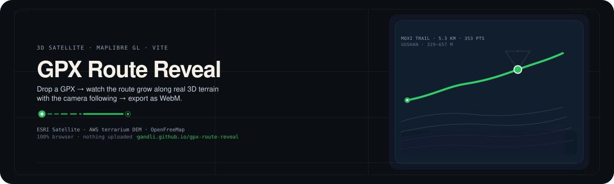

# 🗺️ GPX Route Reveal

<p align="center">
  
</p>

> Drop in a GPX track → watch the route grow along real 3D terrain on a satellite map, with the camera following → export the animation as video.
> 100% in-browser processing, **nothing is uploaded**.

[](https://maplibre.org/)
[](https://www.typescriptlang.org/)
[](https://vitejs.dev/)
[](https://github.com/gandli/gpx-route-reveal/actions)

[](https://gandli.github.io/gpx-route-reveal/)

English | [简体中文](README.zh-CN.md)

A 3D satellite route-reveal animation tool — a modern rewrite of
[3DHikeMap](https://github.com/fredderks/3DHikeMap) (R + Leaflet, abandoned 2019).
Built with Vite + TypeScript + MapLibre GL as a pure-frontend app: no build-time
server, no heavyweight 3D engine.

---

## Animation Demo

**Moxi Trail** (Gushan, Fuzhou, 5.3 km, 329–657 m elevation) — a real OSM road-network
track. The camera glides along the route while the trail grows out of the 3D terrain:

<video controls width="100%" src="https://github.com/gandli/gpx-route-reveal/releases/download/demo-media/route-reveal3.mp4"></video>

*(MP4, 21 s, 2.3× speed. If the video won't play, see the GIF version below.)*


## Screenshots

| Route reveal | 3D terrain | 3D buildings |
|---|---|---|
|  |  |  |

*Left: the route grows along the satellite imagery with the camera tracking its head.
Middle: 3D terrain from terrarium DEM. Right: OSM vector tiles extruded by real
building height (low buildings pale gray → high buildings warm brown).*

---

## Features

- **Drag & drop** — a demo track (Moxi Trail) loads automatically on open; drop any `.gpx` to replace it
- **Pick a route on the map** — click start, then end: a walking route is generated via BRouter (OSM path network, key-free) and animated the same way
- **Route growth** — a truncated `LineString` driven by cumulative distance; the green trail grows from the start along the terrain
- **Smooth camera follow** — low-pass filter on all camera parameters; the lens eases along the track with no jitter
- **Real 3D terrain** — AWS terrarium DEM elevation grid, 2.5× exaggeration for depth
- **3D buildings** — OpenFreeMap OSM vector tiles with `fill-extrusion`, color-graded by `render_height`
- **Local WebM export** — `canvas.captureStream` + `MediaRecorder`, zero dependencies, zero upload

## Tech Stack

| Component | Implementation |
|---|---|
| Build | Vite 6 + TypeScript strict |
| Map / 3D | MapLibre GL 4 (raster DEM + terrain + fill-extrusion) |
| Route animation | Truncated GeoJSON `LineString` + cumulative-distance sampling |
| Camera | `jumpTo` + low-pass-filtered interpolation |
| Routing | BRouter Web API (OSM `shortest` profile, GeoJSON out, key-free) |
| Export | `MediaRecorder` over canvas stream → WebM |

Deliberately no Three.js / Turf.js / WebCodecs — MapLibre already covers terrain,
the route animation is a few lines of geometry, and `MediaRecorder` is the native
export path.
`ponytail:` if real MP4/H.264 is ever needed, swap `recorder.ts` for WebCodecs
`VideoEncoder` + `mp4-muxer`; the canvas capture pipeline stays unchanged.

## Quick Start

**[Try it live →](https://gandli.github.io/gpx-route-reveal/)** — no install needed. Or run locally:

```bash
npm install
npm run dev
# Open http://localhost:5173 — the Moxi Trail demo loads automatically; drop any .gpx to replace it
```

## Usage

1. Open the app (or visit it on your LAN at `http://<your-ip>:5173`)
2. Drop in a `.gpx` track file — or hit **Pick route** and click a start and end point on the map
3. **Play** → the camera flies in, the route grows along the terrain, the camera follows the route head
4. **Export** → records the current animation as `.webm` (keep the tab visible)

Data sources: satellite imagery © Esri World Imagery; terrain DEM © AWS terrarium
(based on MapTiler/OpenTopography); buildings © OpenFreeMap / OpenMapTiles, data
from OpenStreetMap. All key-free.

## Development

```bash
npm run build      # type check + bundle
node --experimental-strip-types src/gpx.ts   # GPX parser self-check
npx tsc --noEmit   # type check
```

## References

- [3DHikeMap](https://github.com/fredderks/3DHikeMap) — the original (R + Leaflet)
- [MapLibre GL JS](https://maplibre.org/maplibre-gl-js/docs/) — the map rendering engine

## License

MIT
