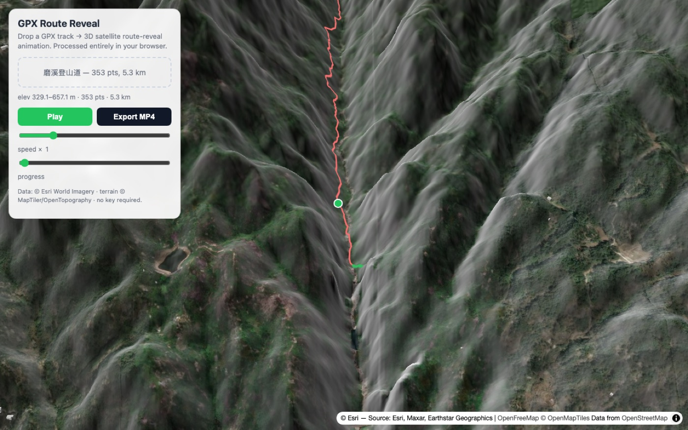
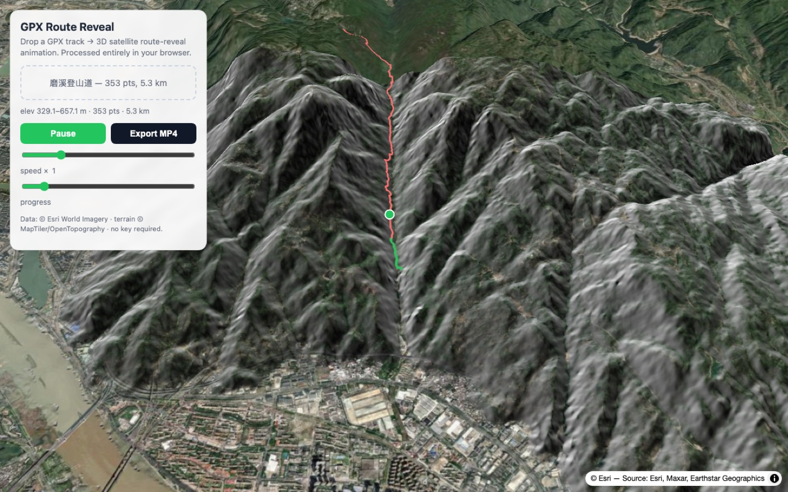
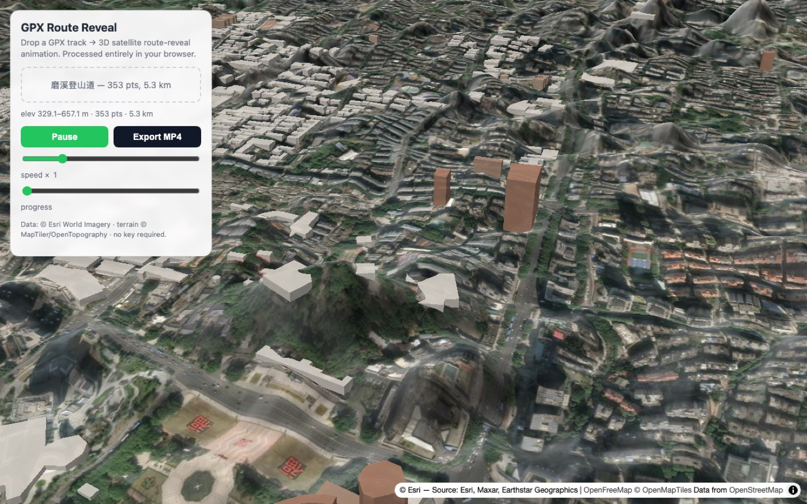

# 🗺️ GPX Route Reveal（简体中文）

<p align="center">
  
</p>

> 拖入 GPX 轨迹 → 3D 卫星地图上路线沿地形生长 + 相机跟随 → 一键导出视频。
> 100% 浏览器内处理，**不上传任何数据**。

[](https://maplibre.org/)
[](https://www.typescriptlang.org/)
[](https://vitejs.dev/)
[](https://github.com/gandli/gpx-route-reveal/actions)

[](https://gandli.github.io/gpx-route-reveal/)

[English](README.md) | 简体中文

3D 卫星地图路线生长动画工具 —— 现代重写旧
[3DHikeMap](https://github.com/fredderks/3DHikeMap)（R + Leaflet，2019 年停更）。
Vite + TypeScript + MapLibre GL 纯前端实现，无构建期服务器、无重量级 3D 引擎。

---

## 动画演示

**磨溪登山道**（福州鼓山，5.3 km，329–657 m 海拔）—— 真实 OSM 路网轨迹，
相机沿路线平滑跟随，路线从起点沿 3D 地形生长：

<video controls width="100%" src="https://github.com/gandli/gpx-route-reveal/releases/download/demo-media/route-reveal3.mp4"></video>

*(MP4，21 秒，2.3× 加速。若无法播放视频，见下方 GIF 版本。)*


## 静态截图

| 路线生长 | 3D 地形 | 3D 建筑 |
|---|---|---|
|  |  |  |

*左：路线沿卫星图生长，相机跟随头部。中：terrarium DEM 渲染的 3D 山体起伏。
右：OSM 矢量 tile 按真实高度挤出的 3D 建筑（矮楼浅灰 → 高楼暖棕）。*

---

## 核心特性

- **拖放即用** —— 打开页面自动加载磨溪登山道 demo，手机也能看（无需拖文件）
- **地图选点生成路线** —— 点击起点、终点，经 BRouter（OSM 步道网络，免 key）生成步行路线并同管线播放动画
- **路线生长** —— 截断 `LineString` 沿累积距离驱动，绿色路线从起点沿地形生长
- **相机平滑跟随** —— 低通滤波全部相机参数，镜头沿轨迹缓动转向，无抖动
- **真实 3D 地形** —— AWS terrarium DEM 高程网格，2.5× 夸张增强立体感
- **3D 建筑** —— OpenFreeMap OSM 矢量 tile `fill-extrusion`，按 `render_height` 分色
- **本地导出 WebM** —— `canvas.captureStream` + `MediaRecorder`，零依赖零上传

## 技术栈

| 组件 | 实现 |
|---|---|
| 构建 | Vite 6 + TypeScript strict |
| 地图 / 3D | MapLibre GL 4（raster DEM + terrain + fill-extrusion） |
| 路线动画 | 截断 GeoJSON `LineString` + 累积距离采样 |
| 相机 | `jumpTo` + 低通滤波插值 |
| 路线规划 | BRouter Web API（OSM `shortest` profile，GeoJSON 输出，免 key） |
| 导出 | `MediaRecorder` over canvas stream → WebM |

刻意不引入 Three.js / Turf.js / WebCodecs —— MapLibre 已覆盖地形，
路线动画只需几行几何，MediaRecorder 是原生导出路径。
`ponytail:` 若以后要真 MP4/H.264，把 `recorder.ts` 换成
WebCodecs `VideoEncoder` + `mp4-muxer`，canvas 采集管线不变。

## 快速开始

**[在线体验 →](https://gandli.github.io/gpx-route-reveal/)** —— 免安装。本地运行：

```bash
npm install
npm run dev
# 打开 http://localhost:5173 —— 磨溪登山道 demo 自动加载，拖入任意 .gpx 替换
```

## 使用

1. 打开应用（或局域网访问 `http://<你的IP>:5173`）
2. 拖入 `.gpx` 轨迹文件 —— 或点 **Pick route**，在地图上点起点、终点
3. **Play** → 相机飞入、路线沿地形生长、相机跟随路线头
4. **Export** → 录制当前动画为 `.webm`（保持标签页可见）

数据源：卫星影像 © Esri World Imagery；地形 DEM © AWS terrarium
（源自 MapTiler/OpenTopography）；建筑 © OpenFreeMap / OpenMapTiles，数据来自
OpenStreetMap。全部免 API key。

## 开发

```bash
npm run build      # 类型检查 + 打包
node --experimental-strip-types src/gpx.ts   # GPX 解析器自检
npx tsc --noEmit   # 类型检查
```

## 参考

- [3DHikeMap](https://github.com/fredderks/3DHikeMap) —— 原版（R + Leaflet）
- [MapLibre GL JS](https://maplibre.org/maplibre-gl-js/docs/) —— 地图渲染引擎

## License

MIT
